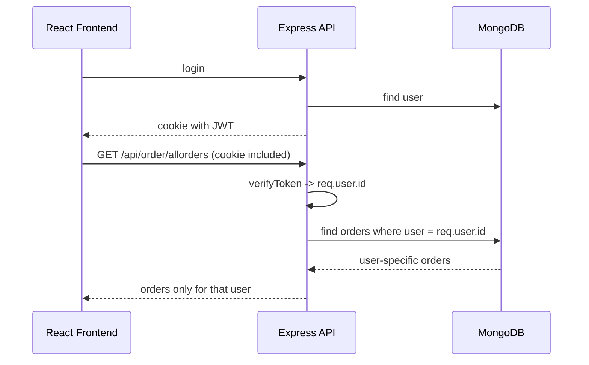

# Per-User Orders, Holdings, and Positions in MERN

This document explains how to make `orders`, `holdings`, and `positions` unique for each logged-in user in this MERN stock-trading app.

## What is happening today

Right now the app stores these records as shared collections:

- [backend/src/models/order.model.js](../backend/src/models/order.model.js)
- [backend/src/models/holding.model.js](../backend/src/models/holding.model.js)
- [backend/src/models/postition.model.js](../backend/src/models/postition.model.js)

That means every user reads from the same MongoDB documents. So if one user places an order, every other user can see it too.

## Goal

We want this behavior:

- every user sees only their own orders, holdings, and positions
- when a user is deleted, all related trading data is deleted too
- when a user logs in, the dashboard loads only that user’s data
- the rest of the app can stay shared, such as watchlist UI, layout, and general navigation

## Recommended data model

Add a `user` reference to each trading collection.

### Order model

```js
const mongoose = require("mongoose");

const orderSchema = new mongoose.Schema({
  user: {
    type: mongoose.Schema.Types.ObjectId,
    ref: "user",
    required: true,
    index: true,
  },
  name: { type: String, required: true },
  qty: { type: Number, required: true },
  price: { type: Number, required: true },
  mode: { type: String, required: true },
}, { timestamps: true });

module.exports = mongoose.model("order", orderSchema);
```

### Holding model

```js
const mongoose = require("mongoose");

const holdingSchema = new mongoose.Schema({
  user: {
    type: mongoose.Schema.Types.ObjectId,
    ref: "user",
    required: true,
    index: true,
  },
  name: { type: String, required: true },
  qty: { type: Number, required: true },
  avg: { type: Number, required: true },
  price: { type: Number, required: true },
  net: { type: String, required: true },
  day: { type: String },
  isLoss: { type: Boolean, default: false },
}, { timestamps: true });

module.exports = mongoose.model("holding", holdingSchema);
```

### Position model

```js
const mongoose = require("mongoose");

const positionSchema = new mongoose.Schema({
  user: {
    type: mongoose.Schema.Types.ObjectId,
    ref: "user",
    required: true,
    index: true,
  },
  product: { type: String, required: true },
  name: { type: String, required: true },
  qty: { type: Number, required: true },
  avg: { type: Number, required: true },
  price: { type: Number, required: true },
  net: { type: String, required: true },
  day: { type: String },
  isLoss: { type: Boolean, default: false },
}, { timestamps: true });

module.exports = mongoose.model("position", positionSchema);
```

## Why the `user` field is enough

The JWT already identifies the logged-in user.

Current auth flow:

- [backend/src/utils/createSecretToken.js](../backend/src/utils/createSecretToken.js) creates a token with `{ id }`
- [backend/src/middlewares/verifyToken.js](../backend/src/middlewares/verifyToken.js) reads the token and attaches the payload to `req.user`

So in protected routes we can use:

```js
const userId = req.user.id;
```

That becomes the filter for every query.

## Route changes

## 1) Protect the trading routes

Make these routes user-aware:

- [backend/src/routes/order.routes.js](../backend/src/routes/order.routes.js)
- [backend/src/routes/holding.routes.js](../backend/src/routes/holding.routes.js)
- [backend/src/routes/position.routes.js](../backend/src/routes/position.routes.js)

Example pattern:

```js
const express = require("express");
const router = express.Router();
const orderModel = require("../models/order.model");
const holdingModel = require("../models/holding.model");
const { verifyToken } = require("../middlewares/verifyToken");

router.use(verifyToken);

router.get("/allorders", async (req, res) => {
  const orders = await orderModel.find({ user: req.user.id });
  res.json(orders);
});
```

## 2) Save user-owned data on create

When a new order is created, store the current user ID with it.

```js
router.post("/neworder", async (req, res) => {
  const newOrder = new orderModel({
    user: req.user.id,
    name: req.body.name,
    qty: req.body.qty,
    price: req.body.price,
    mode: req.body.mode,
  });

  await newOrder.save();
  res.status(200).json("Order Saved Successfully");
});
```

## 3) Rebuild holdings only for that user

Your current [backend/src/routes/order.routes.js](../backend/src/routes/order.routes.js) rebuilds holdings from all orders. That must become per-user logic.

Instead of:

```js
const orders = await orderModel.find({});
```

use:

```js
const orders = await orderModel.find({ user: userId });
```

Then delete and reinsert only that user’s holdings:

```js
await holdingModel.deleteMany({ user: userId });
await holdingModel.insertMany(newHoldings.map(item => ({
  ...item,
  user: userId,
})));
```

## 4) Query holdings and positions by user

```js
router.get("/allholdings", async (req, res) => {
  const holdings = await holdingModel.find({ user: req.user.id });
  res.status(200).json(holdings);
});
```

```js
router.get("/allpositions", async (req, res) => {
  const positions = await positionModel.find({ user: req.user.id });
  res.status(200).json(positions);
});
```

## 5) Delete all related data when a user is deleted

This is the cascade-delete part.

Best beginner-friendly approach: delete the child collections in the user delete route or service.

```js
const userModel = require("../models/user.model");
const orderModel = require("../models/order.model");
const holdingModel = require("../models/holding.model");
const positionModel = require("../models/postition.model");

router.delete("/users/:id", async (req, res) => {
  const userId = req.params.id;

  await Promise.all([
    orderModel.deleteMany({ user: userId }),
    holdingModel.deleteMany({ user: userId }),
    positionModel.deleteMany({ user: userId }),
    userModel.findByIdAndDelete(userId),
  ]);

  res.json({ message: "User and related trading data deleted." });
});
```

If you want MongoDB to handle it automatically, you can also use a Mongoose middleware hook, but explicit deletion is easier for beginners to understand and debug.

## Frontend changes

The frontend should not send `userId` manually if authentication is cookie-based.
The server should read the logged-in user from the token.

### 1) Send cookies with axios

Update requests in the dashboard pages so the browser sends the auth cookie:

```js
axios.get("http://localhost:8000/api/holding/allholdings", {
  withCredentials: true,
});
```

Do the same for orders and positions.

### 2) Refresh data after mutations

After placing or deleting an order, refetch:

- orders for the current user
- holdings for the current user
- positions for the current user

Your current UI already listens to `refresh-data` events in some components. That pattern can stay, but the fetch call must be user-scoped on the backend.

### 3) No change needed for shared UI

These parts stay common for all users:

- layout
- navbar
- watchlist display
- product cards
- landing pages

Only the backend data layer becomes per-user.

## Suggested request flow



## Minimum implementation checklist

1. Add `user` to `order`, `holding`, and `position` schemas.
2. Use `verifyToken` on trading routes.
3. Filter every query with `req.user.id`.
4. Save `user: req.user.id` whenever a trading document is created.
5. Rebuild holdings only from that user’s orders.
6. Delete child records when deleting a user.
7. Add `withCredentials: true` to frontend axios calls.

## Important note about the current code

The current [backend/src/routes/order.routes.js](../backend/src/routes/order.routes.js) rebuilds holdings from the entire order collection and uses random values for day change. That is fine for demo data, but once you make it per-user, rebuild logic should only use the current user’s orders.

## Simple mental model for beginners

Think of the `user` field as a label attached to every order, holding, and position.

When the request comes in, the server asks: "Which user is this?"
Then it only reads or writes documents with that same label.

That is the core of multi-user data isolation in MERN.
